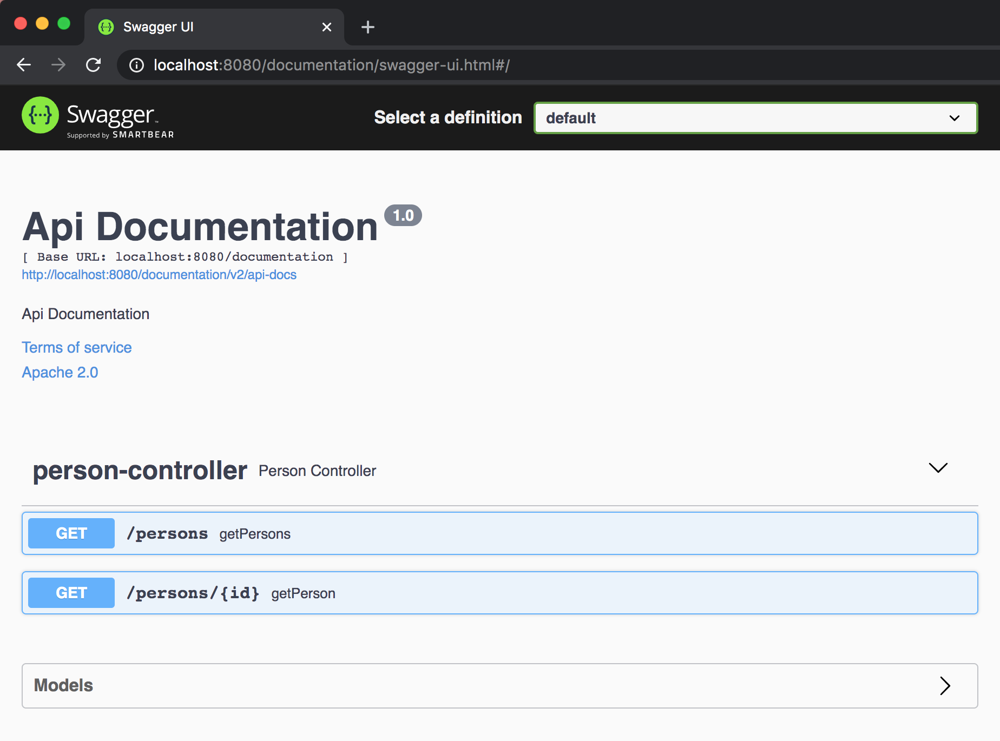

# swagger-webflux-starter

> This is an example project illustrating how to use swagger with webflux. 
> Also illustrate how to set context path in Netty(Similar configuration is available for other containers).
## Requirements

- Java 8

## Installation

```bash
$ git clone https://github.com/remesh-pillai/spring-webflux-swagger.git
```

## Usage

```bash
$ mvn clean package
```

Now open your favorite web-browser (Firefox) to `http://localhost:8080/configuration/swagger-ui.html`. This will lists down all the 
endpoints from PersonController.




